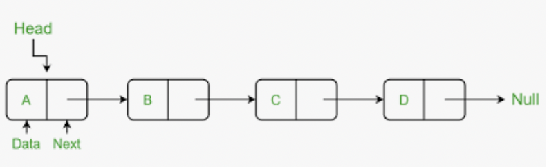
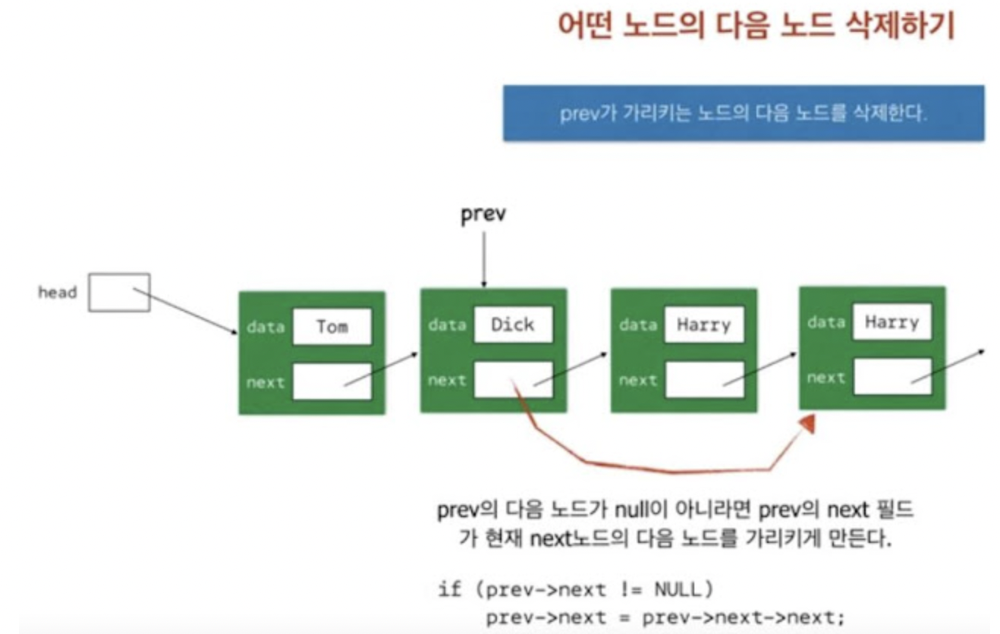
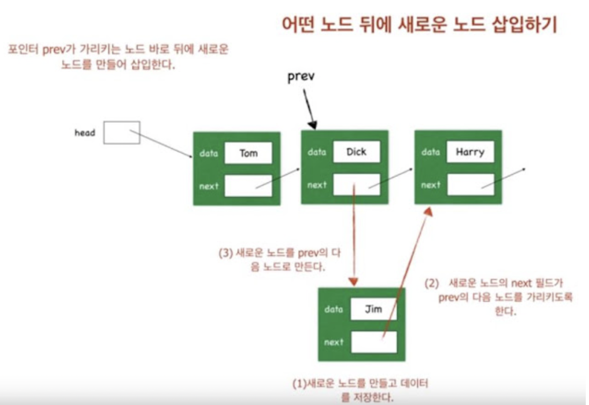
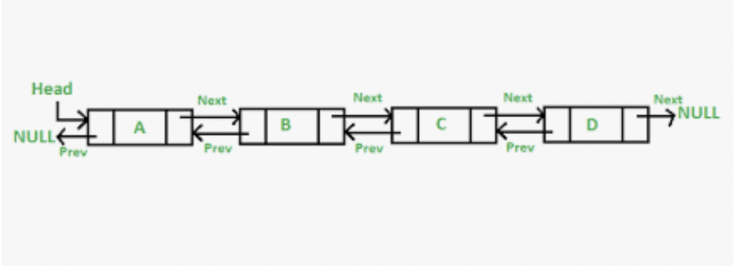
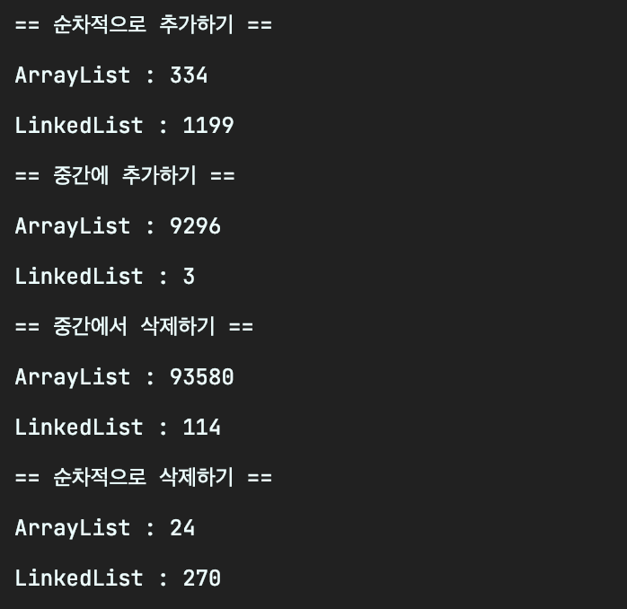
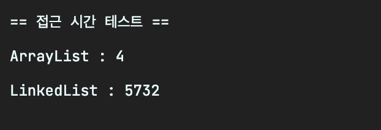

### LinkedList란

- 배열은 다음과 같은 장점을 가지고 있다.
    - 접근하기 쉽다.
    - 사용하기 쉽다.
    - 구조가 간단하다.
- 하지만 다음과 같은 단점도 있다.
    - 크기를 변경할 수 없다. 변경하려면 새로운 배열을 만들어서 복사해야 한다. 아니면 애초에 크게 만들어야 하는데, 메모리가 낭비된다.
    - 중간에 데이터를 삽입하거나 삭제할 때 시간이 많이 걸린다.
- 이를 보완하기 위한 것이 `LinkedList`이다.
    - 배열은 데이터가 연속적으로 붙어있지만
    - LinkedList는 불연속적으로 존재하는 데이터를 연결한 형태이다.

      

      [사진출처]([https://www.geeksforgeeks.org/what-is-linked-list/](https://www.geeksforgeeks.org/what-is-linked-list/))

        ```java
        class Node {
        	Node next; // 다음 요소의 주소를 저장
        	Object data; // 내 데이터를 저장
        }
        ```

      그림과 코드에서 알 수 있듯이 각 요소들은 자신과 연결된 다음 요소의 값(next)와 본인 데이터(data)를 가지고있다.


### 배열에서 데이터 삽입, 삭제에 시간이 많이 소요됐다고?

- LinkedList에서 삭제는 매우 쉽다.

  

  [사진출처]([http://dorson23.blogspot.com/2018/02/c-3-linkedlist.html](http://dorson23.blogspot.com/2018/02/c-3-linkedlist.html))

    1. 삽입하고자 하는 새로운 노드를 만들고
    2. 삽입되고 싶은 지점의 앞에 있는 노드(prev)의 next가 새로운 노드를 가리키게 하고
    3. 새로운 노드를 next가 prev의 다음 노드를 가리키게 하면 된다.
- 삽입도 쉽다.

  

  [사진출처]([http://dorson23.blogspot.com/2018/02/c-3-linkedlist.html](http://dorson23.blogspot.com/2018/02/c-3-linkedlist.html))

    1. 삭제하고자 하는 노드의 앞에 있는 노드(prev)의 next값을 삭제하고자 하는 노드의 next 값으로 갱신하면 된다.
    2. 단, 사진에서 나와있듯 prev 노드가 있을 때의 한해서다.
        1. prev 노드가 없다면 head가 내가 아닌 내 다음 노드를 가리키게 하면 된다.

### 이런 LinkedList에도 단점이?

- LinkedList는 단뱡향이기 때문에 이전요소로의 접근은 어렵다.
- 그리하여 이를 보완한 것이 `DoubleLinkedList` 이중 연결리스트이다.
- 참조 변수를 하나 더 추가해서 이전 노드를 가리키는 정보까지 담아두었다.

  

  [사진출처]([https://www.geeksforgeeks.org/what-is-linked-list/](https://www.geeksforgeeks.org/what-is-linked-list/))

    ```java
    class Node {
        Node prev;
        Node next; // 다음 요소의 주소를 저장
        Object data; // 내 데이터를 저장
    }
    ```

- 그래서 **실제로 LinkedList클래스는 이름과 달리 더블 링크드 리스트로 구현이 되어있다고 한다.**

### 직접 성능 테스트를 해보자

- 자바의 정석을 참고하였다.

```java
import java.util.ArrayList;
import java.util.LinkedList;
import java.util.List;

public class ArrayList_VS_LinkedListTest {
    public static void main(String[] args) {
        // 단순히 저장하는 시간만 비교할 수 있도록 초기용량을 충분히 설정
        List<Integer> al = new ArrayList<>(2_000_000);
        List<Integer> ll = new LinkedList<>();

        System.out.println("== 순차적으로 추가하기 ==");
        System.out.println("ArrayList : " + add1(al));
        System.out.println("LinkedList : " + add1(ll));

        System.out.println("== 중간에 추가하기 ==");
        System.out.println("ArrayList : " + add2(al));
        System.out.println("LinkedList : " + add2(ll));

        System.out.println("== 중간에서 삭제하기 ==");
        System.out.println("ArrayList : " + remove2(al));
        System.out.println("LinkedList : " + remove2(ll));

        System.out.println("== 순차적으로 삭제하기 ==");
        System.out.println("ArrayList : " + remove1(al));
        System.out.println("LinkedList : " + remove1(ll));
    }

    private static long add1(List<Integer> list) {
        long start = System.currentTimeMillis();
        for (int i = 0; i < 10_000_000; i++) list.add(i);
        long end = System.currentTimeMillis();
        return end - start;
    }

    private static long add2(List<Integer> list) {
        long start = System.currentTimeMillis();
        for (int i = 0; i < 1_000; i++) list.add(500, -1);
        long end = System.currentTimeMillis();
        return end - start;
    }

    private static long remove1(List<Integer> list) {
        long start = System.currentTimeMillis();
        for (int i = list.size() - 1; i >= 0; i--) list.remove(i);
        long end = System.currentTimeMillis();
        return end - start;
    }

    private static long remove2(List<Integer> list) {
        long start = System.currentTimeMillis();
        for (int i = 0; i < 10_000; i++) list.remove(i);
        long end = System.currentTimeMillis();
        return end - start;
    }
}
```



- 순차적으로 추가/삭제하는 경우에는 ArrayList가 상당히 빠르다.
- 중간에서 추가/삭제하는 경우에는 LinkedList가 상당히 빠르다

### 접근하는 면에서는 어떨까?

```java
import java.util.ArrayList;
import java.util.LinkedList;
import java.util.List;

public class ArrayList_VS_LinkedListTest2 {
    public static void main(String[] args) {
        List<Integer> al = new ArrayList<>(1_000_000);
        List<Integer> ll = new LinkedList<>();

        add(al);
        add(ll);

        System.out.println("== 접근 시간 테스트 ==");
        System.out.println("ArrayList : " + access(al));
        System.out.println("LinkedList : " + access(ll));
    }

    private static void add(List<Integer> list) {
        for (int i = 0; i < 100_000; i++) {
            list.add(i);
        }
    }

    private static long access(List<Integer> list) {
        long start = System.currentTimeMillis();
        for (int i = 0; i < 100_000; i++) {
            list.get(i);
        }
        long end = System.currentTimeMillis();
        return end - start;
    }
}
```



- 배열은 요소들이 연속적으로 존재하기 때문에, 주소를 빠르게 계산해서 접근할 수 있다.
- LinkedList는 찾는 요소가 몇번째에 있는지 알수 없기 때문에 처음부터 n번째 데이터까지 모두 탐색하는 수밖에 없다. ⇒ 접근 시간이 길어진다는 단점이 있다.

| 컬렉션 | 읽기(접근 시간) | 추가 / 삭제 | 비고 |
| --- | --- | --- | --- |
| ArrayList | 빠르다 | 느리다 | 순차적인 추가/삭제는 얘가 더 빠름 |
| LinkedList | 느리다 | 빠르다 |  |

### 의외의 꿀팁

- 두 클래스의 장점을 이용해서 두 클래스를 조합해서 사용할 수도 있다.

```java
// 먼저 순차적인 추가는 ArrayList로 작업하고
List<Integer> al = new ArrayList<>(1_000_000);
for (int i = 0; i < 100_000; i++) {
    al.add(i);
}

// 중간에서 추가할 작업이 있을 때는 LinkedList로 바꿔서 작업하고
List<Integer> ll = new LinkedList<>(al); // 이렇게 변환이 가능하다
for (int i = 0; i < 1000; i++) ll.add(500, -1);
```